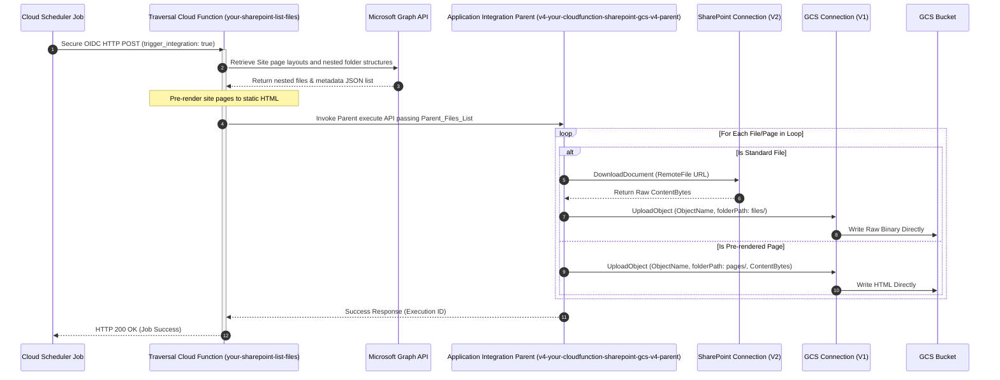

# Handbook: Deploying Serverless SharePoint-to-GCS Synchronization Pipeline
*A production-ready playbook for deploying, scheduling, and maintaining a secure, serverless SharePoint-to-GCS synchronization pipeline utilizing a traversal Python Cloud Function and Google Application Integration.*

---

## Overview & Architecture Topology
Native SharePoint connector limitations prevent listing files and dynamic subfolders from individual subsite collections under OAuth configurations. To resolve this securely while preserving optimal transfer speeds, we utilize a **Hybrid serverless design**:

1.  **Traversal Cloud Function (`your-sharepoint-list-files`)**: Recursively queries the Microsoft Graph API to resolve nested directory hierarchies and pre-renders modern SharePoint canvas pages into high-fidelity static HTML files.
2.  **Orchestration Engine (`v4-your-cloudfunction-sharepoint-gcs-v4`)**: Google Application Integration parent-child loops iterate over the files list, downloading documents from SharePoint and streaming raw uncorrupted bytes directly to GCS.



---

## I. PRE-REQUIREMENTS CHECK

Verify all Microsoft and Google Cloud parameters are correctly provisioned before executing the deployment.

### 1. Live Sandbox Environment Parameters
The configuration values used in our successful, fully active simulation are:
*   **GCP Project ID**: `your-gcp-project-id`
*   **GCP Region**: `asia-southeast1`
*   **Service Account**: `your-custom-service-account@your-gcp-project-id.iam.gserviceaccount.com`
*   **Microsoft Tenant ID**: `YOUR_MICROSOFT_TENANT_ID`
*   **Azure Client ID**: `YOUR_MICROSOFT_CLIENT_ID`
*   **GCS Target Bucket**: `your-gcs-sync-bucket-name`
*   **SharePoint Subsite**: `https://your-tenant.sharepoint.com/sites/your-sharepoint-subsite-name`
*   **Parent Integration**: `v4-your-cloudfunction-sharepoint-gcs-v4-parent`
*   **Child Integration**: `v4-your-cloudfunction-sharepoint-gcs-v4-child`

### 2. Microsoft Azure App Scopes Required
The registered Azure App must be granted both **Delegated and Application** types for these scopes:
*   `Sites.Read.All` — To fetch Site IDs and traverse folder collections recursively.
*   `Files.Read.All` — To retrieve standard file binary streams securely.
*   `User.Read.All` — To resolve document owners and creator profiles during listing.
*   `User.Read` (Delegated - Default).

### 3. Pre-flight Diagnostic Commands (GCP CLI)
Verify that all backing APIs are enabled and access controls are active on the backend:
```bash
# 1. Verify enabled APIs
gcloud services list --enabled \
    --filter="config.name:(connectors.googleapis.com OR integrations.googleapis.com OR run.googleapis.com OR cloudfunctions.googleapis.com)"

# 2. Verify Secret Accessor Role is bound
gcloud secrets get-iam-policy your-secret-sharepoint-clientsecret --format="table(bindings.role, bindings.members)"
```

---

## II. EXECUTION

Follow these step-by-step commands to build and deploy the serverless sync pipeline.

### Step 1: Review & Update Environment Settings
Ensure that `parameters.json` is populated with your target configurations:
```json
{
  "CONFIG_ProjectId": "your-gcp-project-id",
  "CONFIG_Location": "asia-southeast1",
  "CONFIG_Service_Account": "your-custom-service-account@your-gcp-project-id.iam.gserviceaccount.com",
  "CONFIG_GCS_Bucket": "your-gcs-sync-bucket-name",
  "CONFIG_GCS_Connection": "projects/your-gcp-project-id/locations/asia-southeast1/connections/your-gcs-connection",
  "CONFIG_SharePoint_Connection": "projects/your-gcp-project-id/locations/asia-southeast1/connections/your-sharepoint-connection",
  "CONFIG_Child_Integration_Name": "v4-your-cloudfunction-sharepoint-gcs-v4-child",
  "CONFIG_Parent_Integration_Name": "v4-your-cloudfunction-sharepoint-gcs-v4-parent",
  "CONFIG_Library": "Shared Documents"
}
```

### Step 2: Deploy the Traversal Cloud Function
Run the pre-configured deployer script to upload and compile the Python Cloud Function:
```bash
chmod +x deploy_cf.sh
./deploy_cf.sh
```

### Step 3: Bind Invoker Permissions on Gen2 Cloud Run Service
Because Gen2 Cloud Functions execute on top of Cloud Run, we must grant the Scheduler's service account permission to invoke the underlying container securely:
```bash
gcloud run services add-iam-policy-binding your-sharepoint-list-files \
  --region="asia-southeast1" \
  --member="serviceAccount:your-custom-service-account@your-gcp-project-id.iam.gserviceaccount.com" \
  --role="roles/run.invoker"
```

### Step 4: Auto-Parameterize & Deploy Integration Workflows
Run the compiler and deployment script. This compiles the local integration workflow files (`v4_child_workflow.json` and `v4_parent_workflow.json`) into Rest API formats, injects parameters, and publishes them as live, active integrations:
```bash
python3 deploy_v4_workflows.py
```

### Step 5: Schedule E2E Automated Synchronization (Cloud Scheduler)
Configure Google Cloud Scheduler to trigger the entire pipeline directly. Since we built direct integration triggering into the Cloud Function, **no external scripting, virtual machines, or containers are required**:

```bash
gcloud scheduler jobs create http your-sharepoint-sync-hourly \
  --schedule="0 * * * *" \
  --uri="https://your-sharepoint-list-files-xxxxxx-as.a.run.app" \
  --http-method=POST \
  --headers="Content-Type=application/json" \
  --message-body='{"site_name": "your-sharepoint-subsite-name", "library_name": "Shared Documents", "trigger_integration": true, "integration_name": "v4-your-cloudfunction-sharepoint-gcs-v4-parent", "location": "asia-southeast1"}' \
  --oidc-service-account-email="your-custom-service-account@your-gcp-project-id.iam.gserviceaccount.com" \
  --oidc-token-audience="https://your-sharepoint-list-files-xxxxxx-as.a.run.app" \
  --location="asia-southeast1"
```

---

## III. TEST

To execute diagnostic tests and verify synchronization integrity:

### 1. Manual End-to-End Integration Trigger
Test the entire pipeline by running the manual trigger orchestrator:
```bash
python3 sync_sharepoint_to_gcs.py
```
Verify the terminal outputs:
*   `Step 1`: Invokes Cloud Function successfully returning a count of active files and pages.
*   `Step 2`: Triggers Application Integration and outputs a GCP Execution ID (e.g., `e8fba830-...`).

### 2. Verify Synced Outputs in GCS
Verify that documents and pages have successfully synced into GCS under the correct directories:
```bash
gcloud storage objects list gs://your-gcs-sync-bucket-name/**
```
*👉 Expected Sync Outputs:*
*   `gs://your-gcs-sync-bucket-name/files/` — Contains all traversed document binaries (with original folder structures preserved!).
*   `gs://your-gcs-sync-bucket-name/pages/` — Contains all pre-rendered canvas modern site pages, fully pre-compiled as clean, static `.html` layouts.

---

## IV. TROUBLESHOOTING & FAQS

### 1. Real-time Pipeline Logging Queries
Run these commands to diagnose errors or track sync operations:

*   **Monitor Cloud Function Execution Logs (Traversal & Page pre-rendering)**:
    ```bash
    gcloud logging read "resource.type=cloud_run_revision AND resource.labels.service_name=your-sharepoint-list-files" \
      --limit=20 --format="value(textPayload)" --order=DESC
    ```
*   **Diagnose Cloud Scheduler Execution Status**:
    ```bash
    gcloud scheduler jobs describe your-sharepoint-sync-hourly \
      --location=asia-southeast1 --format="json(lastAttemptTime, status)"
    ```
    *👉 Note: An empty `"status": {}` block confirms the scheduler completed the run with 100% success.*

---

### 2. Key Architectural Gotchas & Fixes

#### **Gotcha 1: Access Denied / IAM Route Invoke Failure**
*   **Symptoms**: The Cloud Scheduler job fails with an authentication error, or the Cloud Function log throws a `run.routes.invoke` permission denial.
*   **Fix**: Gen2 Cloud Functions must have `roles/run.invoker` explicitly bound to the invoking service account on the underlying Cloud Run service (detailed in Section II, Step 3).

#### **Gotcha 2: Task skipped / Join-Dependency Skip Bug**
*   **Symptoms**: The child integration loop completes successfully, but GCS upload tasks are skipped, resulting in empty runs.
*   **Fix**: Application Integration defaults to an AND-join (`WHEN_ALL_SUCCEED`) strategy for incoming edges. If routing splits standard files and pre-rendered pages into separate branches, they must use separate GCS connector upload tasks entirely (Task 4 and Task 7) to prevent joint conditional skip failures.

#### **Gotcha 3: Parameter Casing and Backtick Variable Evaluation**
*   **Symptoms**: Loop iterations fail with unrecognized input array variables.
*   **Fix**: Application Integration variable names evaluated inside condition check mappings must exactly match the backtick format used during parameters initialization (e.g., `` `Is_Page_Flow` ``).
