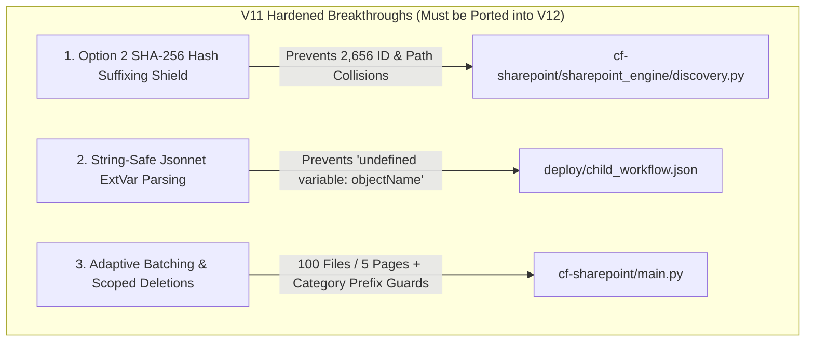

# 🗺️ V11 Category-Based SharePoint-to-GCS Synchronization Step-by-Step Implementation Plan (`plan.md`)

## 1. Goal Description & Executive Summary

The V11 Category-Based Synchronization architecture (`v11-percategory`) transitions our enterprise SharePoint ingestion from a monolithic 20-minute discovery loop (`sites/DEN` crawling **38,823 items across 59 document libraries and 23 subsites** simultaneously) to a modular, fault-isolated, and memory-isolated **Category-Driven Ingestion Pipeline**.

### The 4 Core Pillars of V11:
1. **Decoupled Architecture (`Separation of Concerns`):** `config-parameters.json` becomes your static infrastructure profile (`Project ID`, `Service Account`, `Tenant ID`, `Secret Path`). A new **`config-category.json`** file acts as the dynamic, hot-swappable category matrix. Adding or changing categories requires **zero Docker rebuilds or container deployments**.
2. **Option 1 Single Master Scheduler Loop (`Sequential Sharding`):** Exactly **ONE** Cloud Scheduler cron job is deployed in GCP (`yourorg-sharepoint-sync-daily`). When triggered, `main.py` loads `config-category.json` and iterates cleanly through the category groups one by one. Zero scheduler management clutter for the customer!
3. **Duplicate Crawl Prevention (`include_subsites: false`):** We update `cf-sharepoint/main.py` with an `include_subsites` check around `get_all_subsites_recursive()`, allowing root subsites (`sites/DEN`) to sync only their direct root items without recursively crawling child departments (`Consumer`, `Business`), guaranteeing **zero duplicate objects across the 38,823 inventory**.
4. **Vertex AI Unified Master Metadata Engine (`combine_metadata_shards`):** To satisfy Vertex AI Search's requirement for a single master `metadata.jsonl` catalog while eliminating concurrent write race conditions, each category job writes its own sharded `metadata_part.jsonl`. At the end of the master category loop, an atomic helper merges all shards into `gs://<bucket>/config/metadata.jsonl` while preserving 100% of both `source_url` (GCS text) and `sharepoint_url` (M365 chatbot citation links).

---

### 🚀 1.1. V12 vs V11 Technical Gap Analysis & Mandatory Porting Roadmap
While V12 successfully establishes the category-driven Cloud Run architecture (`config-category.json` matrix and isolated sharded loops), our recent forensic breakthroughs in **Version 11 (`v11-17Jul2026`)** introduced three critical technical improvements that are currently **lacking in V12** and MUST be ported into V12 to guarantee 100% data integrity across all libraries:



#### 1. Option 2 Deterministic SHA-256 Hashed Suffixing (`discovery.py`)
* **The Gap in V12:** V12's `classify_drive_item()` currently assigns unhashed relative paths (`rel_path = f"{parent_path}{item_name}"`). If generic filenames (`1.pdf`, `Slide1.JPG`, `Culture.pdf`) occur across different subfolders inside the same category, they silently overwrite each other in GCS and collide in `metadata.jsonl`.
* **The V11 Cure to Port into V12:** Update `classify_drive_item()` in V12's `discovery.py` (`and cf-sharepoint/sharepoint_engine/discovery.py`) to calculate the 8-character SHA-256 hash derived from the item's immutable `graph_id` / relative path and enforce:
  * **Path Immunity:** `files/{Subsite}/{Library}/{Folder}/{FileBase}_{Hash[:8]}.{ext}` and `pages/{Subsite}/{Folder}/{PageBase}_{Hash[:8]}.pdf`
  * **ID Immunity:** `id: "{BaseName}_{Hash[:8]}"`
  * **Human-Readability Shield:** Keep `structData.title` 100% unhashed (`e.g., "Culture.pdf"`) for clean Vertex AI Search chatbot citations.

#### 2. String-Safe Jsonnet Data Mapping (`deploy/child_workflow.json`)
* **The Gap in V12:** V12's `deploy/child_workflow.json` mapping tasks must be verified against V11 to ensure they do not use direct dot-notation (`item.objectName`) on external variables, which causes `INVALID_ARGUMENT: error executing jsonnet: RUNTIME ERROR: undefined variable: objectName` when special folder characters occur.
* **The V11 Cure to Port into V12:** Port V11's string-safe Jsonnet block into V12's `deploy/child_workflow.json`, strictly using `std.extVar('upload_request')['objectName']` (`and ensuring regular file uploads in Task 3 directly inherit their hashed RelativePath`).

#### 3. Adaptive Batch Sizing & Partition-Scoped Orphan Circuit Breakers (`main.py`)
* **The Gap in V12:** V12 must enforce the exact batch ratios and prefix scoping proven in V11 so that large file arrays don't hit payload limits and orphan deletions never cross category boundaries.
* **The V11 Cure to Port into V12:** 
  1. Batch regular files (`.docx, .xlsx`) at **100 items per API schedule call (`~150 KB payload`)**, and Modern Site Pages (`.aspx`) at **5 items per API call** (`for 15-page Chromium memory recycling`).
  2. Enforce **Partition-Scoped Deletion** inside `Step 7b Orphaned Cleanup` so that when a category worker (`e.g., tier1-consumer`) checks GCS inventory, it only compares and deletes objects whose paths match its assigned category prefix (`categories/consumer/...`).

---

## 2. User Review Required & Design Guardrails

> [!IMPORTANT]
> **Zero Docker Rebuild Guarantee**  
> Once `v11-percategory` is deployed to Cloud Run (`yourorg-sharepoint-sync-v11`), business operators only edit or upload `config-category.json`. No `./deploy/deploy_cloud_run.sh` calls are ever needed when onboarding new departments.

> [!WARNING]
> **Strict Anonymization & Bidirectional Mirroring Mandate**  
> 1. **No Customer Hardcoding:** All code (`.py`, `.sh`) and documentation (`.md`) MUST use generic variables (`<YOUR-PROJECT-ID>`, `<YOUR-GCS-BUCKET>`, `sites/<YOUR-SITE>/<CATEGORY>`).
> 2. **1-to-1 Repository Mirroring:** Every file created or modified in `customer-maxis/.../v11-percategory` will be mirrored automatically to `do-utility/.../v11-percategory` and pushed to GitHub on every turn.

---

## 3. Step-by-Step Implementation Roadmap (`Easy to Follow Engineering Guide`)

### Phase 1: Configuration Decoupling (`config-category.json` & `config-parameters.json`)

#### Step 1.1: Create `config/config-category.json`
Create the dynamic category matrix with the top-level `"root_portal_site"` property and 3-Tier Sharding Matrix (`tier1-den-root-only`, `tier1-business`, `tier1-consumer`, `tier1-hotlink`, `tier1-system-procedure`, `tier2-medium-departments`, `tier3-specialized-teams`). Standardize all entries on `"sharepoint_library": "all"`.

```json
{
  "root_portal_site": "sites/DEN",
  "categories": [
    {
      "category_id": "tier1-den-root-only",
      "display_name": "DEN Root Portal Documents & Guides ONLY",
      "sharepoint_site": "sites/DEN",
      "include_subsites": false,
      "sharepoint_library": "all",
      "gcs_destination_prefix": "categories/den-root/"
    },
    {
      "category_id": "tier1-business",
      "display_name": "Business Department Policies & Documents",
      "sharepoint_site": "sites/DEN/Business",
      "include_subsites": true,
      "sharepoint_library": "all",
      "gcs_destination_prefix": "categories/business/"
    }
  ]
}
```

#### Step 1.2: Clean Up `config-parameters.json`
Remove `CONFIG_Sharepoint_Sites` and `CONFIG_Sharepoint_Library` from `config-parameters.json`. Leave only cloud infrastructure credentials, Secret Manager configuration, and `CONFIG_SharePoint_Hostname`.

#### Step 1.3: Update Configuration Loader (`util/config_loader.py` or `main.py`)
Add a helper `load_sites_sync_config(params)` that attempts to load `config-category.json` from local path `./config/config-category.json` first, or from a GCS configuration bucket (`gs://<bucket>/config/config-category.json`) if running inside Cloud Run.

---

### Phase 2: Fast Discovery & Diagnostic Engine (`check/` utilities)

#### Step 2.1: Create `check/discover_categories.py` (2-Second Fast Discovery)
Build a lightweight script that connects to Microsoft Graph API and lists all child subsite categories directly under `"root_portal_site"` (`sites/DEN`) without querying libraries or counting items:
1. Load OAuth credentials and `CONFIG_SharePoint_Hostname` from `config-parameters.json`.
2. Read `root_portal_site` from `config-category.json` (or accept `--root="sites/DEN"` CLI flag).
3. Query `GET https://graph.microsoft.com/v1.0/sites/{hostname}:/{root_path}` for root ID.
4. Query `GET https://graph.microsoft.com/v1.0/sites/{root_id}/subsites` and print the formatted table.

#### Step 2.2: Update `check/check_syncall_before.py` (Pre-Flight Audit)
Update the pre-sync diagnostic check to read `config-category.json` and support two execution modes:
* **Mode A (Targeted Fast Audit):** If invoked with `--category=tier1-business`, inspect ONLY that category's SharePoint subsite and compare against `gs://<bucket>/categories/business/` in <15 seconds.
* **Mode B (Master Serial Category Loop):** If invoked without `--category`, loop through every category in `config-category.json` sequentially, clearing memory after each category (`target_sites_to_scan.clear()`), and output a unified Category Summary Table across all 38,823 items.

#### Step 2.3: Update `check/check_syncall_after.py` (Post-Flight Audit)
Mirror the exact same Option 1 serial loop and `--category=...` override logic in the post-sync check to verify all files and pages have landed successfully in their respective `gcs_destination_prefix` folders.

---

### Phase 3: Core Synchronization Engine & Vertex AI Master Aggregator (`cf-sharepoint/main.py`)

#### Step 3.1: Option 1 Master Category Loop & Optional On-Demand Overrides
In `main.py`, replace the single-site discovery entry point with a sequential loop over `config-category.json`:
```python
sites_sync_config = load_sites_sync_config(params)
categories_to_sync = sites_sync_config.get("categories", [])

# Check if an operator requested a single-category on-demand override
target_override = os.environ.get("TARGET_CATEGORY_ID") or req_data.get("category_id")
if target_override:
    categories_to_sync = [c for c in categories_to_sync if c.get("category_id") == target_override]
    print(f"🎯 On-Demand Single Category Override Active: Running ONLY '{target_override}'")
else:
    print(f"🔄 Option 1 Master Loop Active: Iterating through {len(categories_to_sync)} category groups sequentially.")

for category in categories_to_sync:
    process_category_sync(category, params, headers)
    # WIPE RAM BUFFER: Ensure no memory bloat or OData session leakage between categories
    clear_category_memory_buffer()
```

#### Step 3.2: Duplicate Prevention (`include_subsites: false`)
Inside `process_category_sync()`, check if the category requests non-recursive / root-only discovery:
```python
include_subsites = category.get("include_subsites", True)

if not include_subsites:
    print(f"🎯 Non-Recursive / Exact Target Mode Active ('include_subsites': False)")
    print(f"   Inspecting only root site '{category['sharepoint_site']}' without crawling child departments.")
    root_site_obj = resolve_site_info(category["sharepoint_site"], headers)
    target_sites_to_scan = [root_site_obj] if root_site_obj else []
else:
    print(f"🏢 Recursive Discovery Mode Active ('include_subsites': True)")
    target_sites_to_scan = get_all_subsites_recursive(category["sharepoint_site"], headers)
```

#### Step 3.3: Sharded Category Metadata Output
Direct every category job to write its local metadata strictly to its category shard with 100% preservation of `source_url` and `sharepoint_url`:
```python
category_prefix = category.get("gcs_destination_prefix", "")
local_shard_path = f"gs://{CONFIG_GCS_Bucket}/{category_prefix.rstrip('/')}/config/metadata_part.jsonl" if category_prefix else f"gs://{CONFIG_GCS_Bucket}/config/metadata_part.jsonl"
upload_to_gcs_atomic(local_shard_path, metadata_lines_buffer)
```

#### Step 3.4: Atomic Master Aggregator (`combine_metadata_shards`)
Execute once after the master category loop finishes:
```python
def combine_metadata_shards(bucket_name):
    print(f"⚡ Master Metadata Aggregator: Combining all category shards into root config/metadata.jsonl...")
    storage_client = storage.Client()
    bucket = storage_client.bucket(bucket_name)
    blobs = list(bucket.list_blobs(prefix="categories/"))
    
    master_catalog = {}
    for blob in blobs:
        if blob.name.endswith("metadata_part.jsonl"):
            content = blob.download_as_text()
            for line in content.strip().splitlines():
                if not line.strip(): continue
                try:
                    entry = json.loads(line)
                    entry_id = entry.get("id") or entry.get("structData", {}).get("source_url")
                    if entry_id:
                        master_catalog[entry_id] = line
                except Exception:
                    pass
                    
    master_blob = bucket.blob("config/metadata.jsonl")
    master_blob.upload_from_string("\n".join(master_catalog.values()) + "\n", content_type="application/jsonl")
    print(f"✅ Master Catalog Updated! Total unified records for Vertex AI Search: {len(master_catalog)}")
```

---

### Phase 4: Deployment Automation & Operator Runbooks (`deploy/` & documentation)

#### Step 4.1: Update Container Deployment Script (`deploy/deploy_cloud_run.sh`)
Update the Cloud Run Job deployment script so it deploys the container with generic infrastructure variables and `CONFIG_SITES_SYNC_PATH=config/config-category.json`.

#### Step 4.2: Create Cloud Scheduler Helper (`deploy/deploy_category_scheduler.sh`)
Create a simple helper script to deploy or check the single Option 1 daily Cloud Scheduler job (`yourorg-sharepoint-sync-daily`).

#### Step 4.3: Create Standardized Operator Runbook (`DO-SYNC-CATEGORY.md`)
Create a comprehensive, copy-pasteable operator guide for Janice detailing:
1. How to run `discover_categories.py` to onboard new child departments.
2. How the nightly Option 1 Master Loop works.
3. How to run on-demand single category overrides (`--update-env-vars="TARGET_CATEGORY_ID=tier1-business"`).
4. How to run Mode A and Mode B diagnostic verification (`check_syncall_before.py` / `check_syncall_after.py`).

---

## 4. Verification Plan

### Automated Tests
1. **Validate JSON Syntax & Matrix Schema:**
   ```bash
   python3 -m json.tool config/config-category.json > /dev/null && echo "✅ config-category.json valid"
   python3 -m json.tool config-parameters.json > /dev/null && echo "✅ config-parameters.json valid"
   ```
2. **Execute Python Syntax & Unit Tests:**
   ```bash
   python3 -m py_compile cf-sharepoint/main.py check/*.py
   python3 -m unittest discover tests -v
   ```

### Manual & Diagnostic Verification
1. **Fast Category Discovery Check:**
   Verify `python3 check/discover_categories.py` completes in **<3 seconds** showing all 23 child departments.
2. **Pre-Flight Targeted Check:**
   Verify `python3 check/check_syncall_before.py --category=tier1-business` completes in **<15 seconds** without crawling other departments.
3. **Pre-Flight Master Loop Check:**
   Verify `python3 check/check_syncall_before.py` iterates through all categories sequentially with clean RAM reclamation.
4. **Master Metadata Verification:**
   Verify via `gcloud storage cat gs://<YOUR-BUCKET>/config/metadata.jsonl | wc -l` that the unified master file contains the merged records from all shards with both `source_url` and `sharepoint_url` intact.
