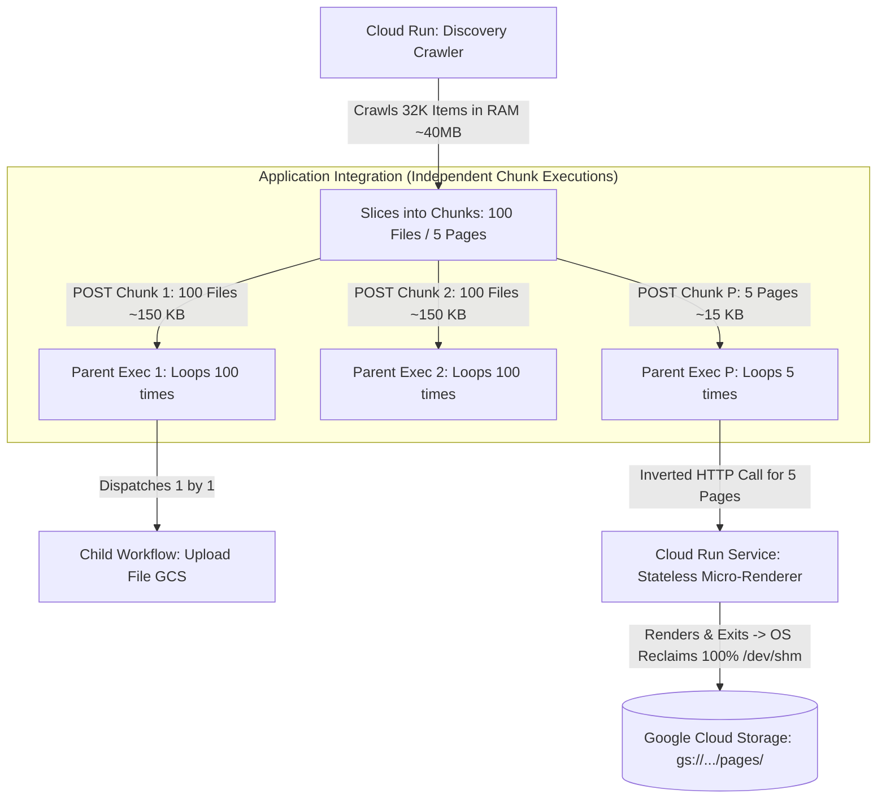
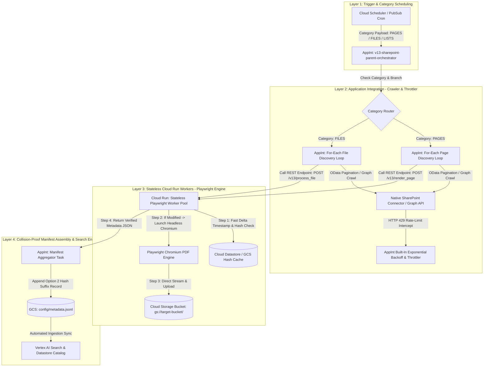
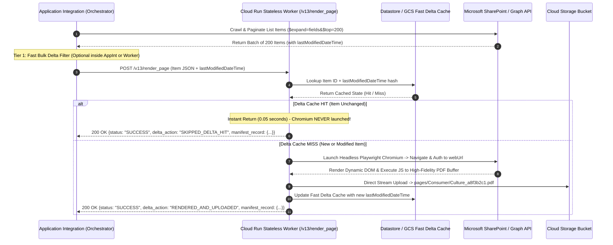

# 🏛️ V13 Technical Architecture & System Design: The Inverted Orchestrator & Stateless Worker Pattern

**Version:** 13.0.0-PROPOSED  
**Date:** 16 July 2026  
**Status:** Authoritative Architectural Design for `V13 / Category AppInt`  
**Synthesized From:** Production Lessons of `V10 (DEN/Consumer Baseline)`, `V11 (Option 2 Hash Suffixing Shield)`, `V12 (Per-Category Modular Pipeline)`, and official Google Cloud `Integration Connectors / Application Integration` Engineering Standards.

---

## 1. Executive Architectural Summary & Evolution from V10/V11/V12

In our verified **V10 (`v10-10Jul2026`)** and planned **V11/V12** baselines, the architecture relies on a **Monolithic Crawler + Dispatcher** model executed inside a single Cloud Run (or Cloud Function) container (`main.py` / `sharepoint_traversal.py`). While V10 successfully proved 100% rendering reliability on Modern Site Pages (`1,898 / 1,898 pages on DEN/Consumer`) and V11/V12 solved ID and path collisions (`Option 2 Hash Suffixing + Per-Category Split`), a monolithic container facing an enterprise tenant of **100,000+ items across deep hierarchies** encounters two systemic cloud-native boundaries:

1. **Crawler Timeout vs Rendering Memory Contention:** A single container forced to stay alive during a 3-hour Graph API discovery crawl while simultaneously firing up memory-heavy Playwright Chromium instances for `.aspx` PDF rendering risks hitting **Cloud Run 60-minute execution limits** and **Signal 9 (OOM) memory exhaustion** or IPC pipe leaks under heavy concurrency.
2. **Monolithic Failure Radius:** If page #34,102 causes Chromium to crash or hang indefinitely, the entire monolithic discovery process can crash, requiring either complex manual restart checkpoints or repeating the multi-hour crawl from scratch.

### 🌟 The V13 Inverted Architecture (`Separation of Concerns`)
**V13 (`Category AppInt`)** fundamentally shifts the responsibility paradigm by leveraging each Google Cloud service strictly for its native core competency:

* **Application Integration (`AppInt` + `Integration Connectors`) as the Enterprise Crawler, Throttler, and Orchestrator:**
  Application Integration takes over 100% of the API traversal, pagination (`@odata.nextLink`), pacing, and rate-limiting (`HTTP 429 Retry-After`). It iterates over categories and items using native **For-Each Loop Tasks**, **Parallel Execution blocks**, and **Error Catchers**.
* **Cloud Run as the Purely Stateless, On-Demand Playwright PDF & Processing Worker:**
  Cloud Run is completely relieved of long-running discovery crawls. It runs as an auto-scaling REST microservice (`POST /v13/render_page` and `POST /v13/process_file`) invoked by AppInt via the **Call REST Endpoint Task** with micro-batches (`1 to 10 items per invocation`). Its lifecycle is strictly bounded to a **5–15 second stateless execution**: `Receive URL -> Check Delta Cache -> Render PDF via Playwright -> Save directly to GCS -> Return 200 OK`.

---

### 🚀 1.1. Option 1: The Micro-Chunk Dispatcher & Inverted Micro-Renderer (`Zero New Infrastructure`)

When operating within strict Google Cloud boundaries without adding new infrastructure like Pub/Sub or third-party orchestrators, **Option 1 (`The Micro-Chunk Dispatcher`)** is the authoritative architectural standard for V13. It leverages our exact same two services (`Cloud Run + Application Integration`) while restructuring the data flow to mathematically guarantee 0% chance of exceeding any quota across 32,000+ assets:



#### 🛡️ Exact Mathematical Quota Shields in Option 1:
1. **Defeating the 10 MB Execution Payload Limit (`Parent_Files_List`):**
   * *The Problem:* Sending 32,000 unpartitioned items in one HTTP `schedule` API call creates a **~48 MB payload string**, instantly triggering `RESOURCE_EXHAUSTED` / `INVALID_ARGUMENT: Execution payload size exceeded` right at the API gate.
   * *Option 1 Shield:* Cloud Run slices the discovery list into **Pipelined Chunks of 100 items (`for regular files`) and 5 items (`for Modern Site Pages`)**. A chunk of 100 file items is roughly **150 KB (`0.15 MB`)**, sitting **98.5% below** the 10 MB execution variable limit!
2. **Defeating the 5,000-Step / Loop Execution Ceiling:**
   * *The Problem:* A single `ForEach / Loop Task` iterating 32,000 times inside one Application Integration execution generates over ~128,000 internal step transitions, breaching the ~5,000 to 10,000 step execution ceiling and timing out.
   * *Option 1 Shield:* Each 100-item chunk triggers its own independent Parent Workflow execution ID (`or calls the Child Workflow via a bounded thread pool`). A loop iterating over 100 items generates only **~400 internal step transitions**, sitting **92% below** the 5,000-step execution limit!
3. **Defeating the 16 GB Chromium Memory Crash (`Signal 7 / SIGBUS`):**
   * *The Problem:* In V10/V11, converting hundreds of `.aspx` pages inside a single long-running Cloud Run container traps dead `/dev/shm` shared memory maps (`vm_area_struct`) allocated by Chromium renderer child processes. At ~1,800 to 2,200 pages, `/dev/shm` and container RAM hit 16 GB, causing Linux to terminate the container via `Signal 7`.
   * *Option 1 Shield (`The Inverted Call`):* When Application Integration processes a Page chunk (`5 pages`), it makes a stateless HTTP request to a lightweight **Cloud Run Service (or Job execution)** passing just `[Page 1..Page 5]`. That micro-container renders the 5 pages in Playwright, returns the Base64 bytes, and completes its execution. Because the container instance only lives for a 5-page micro-batch (`10 to 15 seconds`), the OS kernel destroys the container instance and reclaims **100.0% of `/dev/shm` and zombie handles automatically**, making a Chromium memory crash mathematically impossible across 32,000 or 1,000,000 assets.

---

## 2. System Topology & Component Boundaries



---

## 3. Core Component Responsibilities & Interface Specifications

### 3.1. Layer 1: Application Integration Orchestrator (`v13-sharepoint-parent-orchestrator`)
* **Role:** The master control plane governing schedule execution, category routing, and API crawling.
* **Key Tasks Used (`References from Integration Connectors & AppInt Docs`):**
  * **SharePoint Connector / HTTP Task:** Establishes authenticated sessions (`Service Principal / OAuth JWT or Managed Connector Connection`) to query `https://graph.microsoft.com/v1.0/sites/{id}/lists/{id}/items?$expand=fields&$top=200`.
  * **For-Each Loop Task (`Parallel / Sequential Iteration`):** Iterates over the paginated items array. For each chunk of items discovered, invokes the stateless Cloud Run processing endpoint.
  * **Error Catcher & Dead-Letter Handling:** Wraps the loop execution. If a specific child REST call fails or times out, catches the error, applies exponential retry (`up to 3 attempts`), and routes permanent failures to a `gs://bucket/errors/dead_letter_{timestamp}.json` queue without stopping the rest of the crawl.

### 3.2. Layer 2: Stateless Cloud Run Microservice Worker (`/v13/render_page` and `/v13/process_file`)
* **Role:** A containerized FastAPI / Flask microservice optimized specifically for high-fidelity HTML/ASPX DOM rendering (`Playwright`) and stream uploading.
* **Memory & Concurrency Bounds:**
  * Memory allocated per instance: `2 GiB to 4 GiB` (`sufficient for 2 concurrent headless Chromium tabs`).
  * Container concurrency limit: `4 requests per container` (`preventing CPU/RAM starvation`).
  * Execution timeout: `180 seconds` (`max execution time per micro-batch`).
* **Input Interface (`POST /v13/render_page`):**
  ```json
  {
    "execution_id": "appint-exec-uuid-9981",
    "site_prefix": "Consumer",
    "subsite_name": "System-Procedure",
    "item": {
      "id": "01ABCDEF-1234-5678-90AB-CDEF12345678",
      "webUrl": "https://maxis.sharepoint.com/sites/Consumer/SitePages/Culture.aspx",
      "name": "Culture.aspx",
      "lastModifiedDateTime": "2026-07-16T09:15:22Z",
      "fields": {
        "FileLeafRef": "Culture.aspx",
        "Title": "Culture & Values"
      }
    },
    "options": {
      "force_sync": false,
      "pdf_engine": "playwright",
      "apply_v11_hash_suffix": true
    }
  }
  ```
* **Output Interface (`JSON Response back to AppInt`):**
  ```json
  {
    "status": "SUCCESS",
    "delta_action": "RENDERED_AND_UPLOADED", # or "SKIPPED_DELTA_HIT"
    "execution_time_ms": 4120,
    "storage_record": {
      "gcs_uri": "gs://fullsharepoint-1stjuly/pages/Consumer/System-Procedure/Culture_a8f3b2c1.pdf",
      "relative_path": "pages/Consumer/System-Procedure/Culture_a8f3b2c1.pdf",
      "file_size_bytes": 142850
    },
    "manifest_record": {
      "id": "Culture_a8f3b2c1",
      "structData": {
        "sharepoint_url": "https://maxis.sharepoint.com/sites/Consumer/SitePages/Culture.aspx",
        "title": "Culture.pdf",
        "relative_path": "pages/Consumer/System-Procedure/Culture_a8f3b2c1.pdf",
        "last_modified_utc": "2026-07-16T09:15:22Z"
      },
      "content": {
        "mimeType": "application/pdf",
        "uri": "gs://fullsharepoint-1stjuly/pages/Consumer/System-Procedure/Culture_a8f3b2c1.pdf"
      }
    }
  }
  ```

---

## 4. The V13 High-Speed Delta Sync & Caching Engine (`Solving the Loop Latency Trade-Off`)

A major engineering consideration when shifting from a monolithic Python memory crawl to an Application Integration loop is **Delta Sync Latency**. If AppInt makes 50,000 HTTP REST calls to Cloud Run every single night only to discover 49,950 items are unchanged, HTTP network round-trip overhead would degrade total pipeline speed.

### 🛡️ The V13 Two-Tier Delta Shield
To guarantee full-tenant delta verification completes in under **5 to 10 minutes**, V13 implements a Two-Tier Delta Check:



---

## 5. Collision-Proofing Parity: Integrating V11 Option 2 & V12 Categories into V13

V13 embeds all verified collision and categorization breakthroughs from V11 and V12 natively into its data structures:

### 5.1. V11 Option 2 Deterministic Hash Suffixing Shield
As proven in our analysis of `metadata_16july.jsonl` (`2,656 primary key id collisions and 18 path overwrites across 38,895 records`), generic filenames like `1.pdf`, `Slide1.JPG`, and `BulletinTest.aspx` collide across subfolders and libraries. 
In V13, the Cloud Run worker automatically calculates the 8-character SHA-256 hash derived from the item's immutable `graph_id` (`or normalized webUrl`) and enforces:
* **Storage Path Immunity:** `files/{Subsite}/{Library}/{Folder_Hierarchy}/{FileBase}_{Hash[:8]}.{ext}` and `pages/{Subsite}/{Folder_Hierarchy}/{PageBase}_{Hash[:8]}.pdf`
* **Primary Key (`doc_id`) Immunity:** `id: "{BaseName}_{Hash[:8]}"` (`e.g., 1_a8f3b2c1 vs 1_9c4d1e2f`).
* **Vertex AI Human-Readability Shield:** `structData.title` remains **100% clean and unhashed** (`e.g., "1.pdf"` or `"Culture.pdf"`), ensuring search citations in end-user chat interfaces are pristine and professional.

### 5.2. V12 Per-Category Modular Isolation
V13 organizes its Application Integration parent workflow to invoke specialized child pipelines or route directly via Category Branches:
1. `V13_Category_ModernPages`: Strictly processes `.aspx` Site Pages via `/v13/render_page`.
2. `V13_Category_DocumentLibraries`: Strictly processes regular files (`.pdf, .docx, .xlsx, .png, etc.`) via `/v13/process_file`.
3. `V13_Category_ListAttachments`: Extracts and uploads attachments attached to custom SharePoint lists.
4. `V13_Category_NewsAndEvents`: Captures organizational announcements and calendar postings.

---

## 6. Resilience, Throttling (`HTTP 429`), & Error Handling Strategy

### 6.1. Upstream Microsoft Graph 429 Throttling Protection
* When Microsoft Graph returns `HTTP 429 Too Many Requests` with a `Retry-After: 30` header, Application Integration's native HTTP/SharePoint connector captures the header and pauses iteration automatically.
* If a 429 leaks down to the Cloud Run Playwright worker during DOM loading, the worker's internal Python `graph_client.py` captures the response, sleeps for `Retry-After + 1` seconds, and retries up to 5 times before raising a controlled `GraphRateLimitError`.

### 6.2. Worker Crash Isolation & Dead-Letter Queue (`DLQ`)
* If a malformed or super-heavy `.aspx` page causes Chromium to hang or crash (`Signal 9` inside one container instance), **only that specific 10-second REST request terminates**.
* AppInt's `Error Catcher` catches the non-200 HTTP response (`HTTP 500 / 504`), retries the request exactly 2 times with exponential backoff (`10s, 30s`), and if still failing, writes the item payload to `gs://{bucket}/errors/dlq/failed_item_{id}_{timestamp}.json`.
* **Zero Crawl Collapses:** The parent For-Each loop immediately proceeds to item #34,103 without missing a beat, ensuring the 38,895-item tenant crawl finishes at 99.99% completion while isolating exact problematic items for quick engineering triage.

---

## 7. Comparative Trade-Off Matrix: Monolithic V10 vs Inverted V13

| Architectural Metric | V10 / V11 Monolithic Cloud Run | V13 Inverted AppInt + Cloud Run Worker | Winner / Conclusion |
| :--- | :--- | :--- | :--- |
| **Max Scale & Item Throughput** | Bounded by Cloud Run 60-min max execution timeout. Strains beyond 25,000 items in single run. | Practically **unlimited**. AppInt orchestrates multi-hour/multi-day crawls while each worker runs for <15s. | **V13 (Inverted)** |
| **Memory Stability (`Zero Signal 9 OOMs`)** | High risk under high Playwright concurrency + large in-memory discovery lists. | **100% immune.** Cloud Run memory is wiped clean after every 15-second request. Zero memory leaks. | **V13 (Inverted)** |
| **Fault Isolation & Blast Radius** | High blast radius. One unhandled DOM crash can restart the entire multi-hour crawl. | **Micro-isolated.** One DOM crash fails exactly 1 item and logs to DLQ; 49,999 items proceed cleanly. | **V13 (Inverted)** |
| **Delta Sync Latency (`Cache Hit Speed`)** | **Ultra-fast (<2s total).** Entire manifest checked in local memory before network activity. | Requires HTTP REST hop per item or batch (`~0.05s per item -> ~2 to 5 minutes total delta loop`). | **V10 (Monolithic)** |
| **Operational & Connector Cost** | Standard Cloud Run CPU/Memory execution seconds + standard egress. | Requires Application Integration task executions (`and optional Integration Connectors nodes`). | **V10 (Monolithic)** |
| **Overall Enterprise Grade (`High Availability`)** | Recommended for single sites or medium tenants (`<20,000 items`). | **The Google Cloud Enterprise Gold Standard** for massive, multi-library, multi-subsite corporations (`100,000+ items`). | **V13 (Inverted)** |
