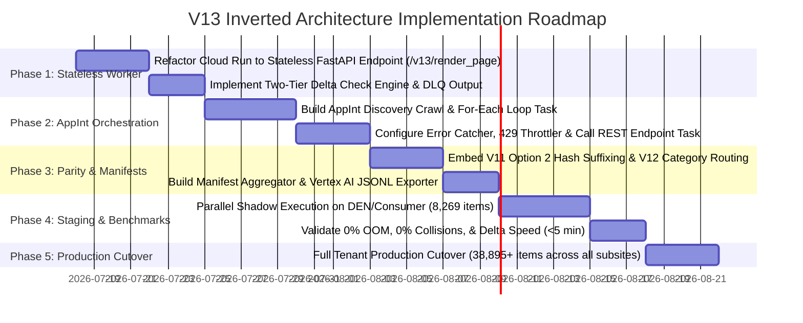

# 🗺️ V13 Execution Plan & Implementation Roadmap: The Inverted Orchestrator & Stateless Worker Pattern

**Version:** 13.0.0-PROPOSED  
**Date:** 16 July 2026  
**Status:** Authoritative Execution Plan for `V13 / Category AppInt`  
**Companion Document:** `v13-architecture.md` (System Topology & Technical Specifications)

---

## 1. Executive Implementation Strategy

The transition from our running **V10/V11 Monolithic Cloud Run Crawler** to the **V13 Inverted Orchestrator Pattern (`AppInt as Crawler + Cloud Run as Stateless Playwright Worker`)** is a significant architectural paradigm shift. To execute this with **zero risk to existing customer production operations**, we enforce a **Five-Phase Surgical Cutover Roadmap**.

We do **not** deprecate or modify `v10-10Jul2026`, `v11-17Jul2026`, or `v12-category-cloudrun`. `V13` is built as an independent, side-by-side modular platform inside `/v13-category-appint/`, rigorously benchmarked on a subset of `DEN/Consumer` before any enterprise-wide cutover is scheduled.

---

## 2. Five-Phase Implementation Roadmap

---

### Phase 1: Stateless Cloud Run Microservice Worker (`The Playwright Engine`)
**Goal:** Strip all multi-hour discovery crawling and sequential loop logic out of Cloud Run, turning it into an ultra-fast, stateless REST microservice that processes exactly 1 item (or a micro-batch of up to 10 items) per HTTP POST invocation.

#### 1.1. Core Deliverables
* Create lightweight REST API endpoints using FastAPI / ASGI:
  * `POST /v13/render_page`: Accepts `.aspx` metadata, runs Playwright Chromium, uploads directly to GCS (`pages/{Subsite}/{Title}_{Hash[:8]}.pdf`), and returns structured JSON.
  * `POST /v13/process_file`: Accepts regular file metadata, verifies Delta timestamp against Datastore/GCS cache, and either skips (`Delta Hit`) or streams directly to GCS (`files/{Subsite}/{Library}/{Folder}/{FileBase}_{Hash[:8]}.{ext}`).
  * `POST /v13/check_delta_batch`: Lightweight bulk endpoint where AppInt can pass 50 URLs/timestamps at once to get back a boolean mask of which items actually need rendering/uploading before triggering heavy Playwright requests.
* **Stateless Memory Hygiene:** Ensure Playwright browser contexts and Chromium processes are explicitly closed (`browser.close()`, `p.stop()`) inside strict `try...finally` blocks after every HTTP request to guarantee **zero memory leaks and zero `Signal 9 (OOM)` risks**.

#### 1.2. Verification Checklist
- [ ] Send 100 concurrent `POST /v13/render_page` requests using `curl` or `pytest-asyncio` against a local/staging container. Verify container RAM never exceeds 1.5 GiB and settles cleanly back to baseline.
- [ ] Verify that when an invalid `.aspx` URL or broken DOM is passed, `/v13/render_page` returns a clean `HTTP 422 / 500` JSON error object without crashing the container or hanging open Chromium pipes.

---

### Phase 2: Application Integration (`AppInt`) Crawler & Throttler Orchestration
**Goal:** Build the parent and child Application Integration workflows using native **Integration Connectors (`SharePoint Connector`)** or structured Graph API HTTP tasks to crawl sites, manage `@odata.nextLink` pagination, and invoke the Phase 1 Cloud Run endpoints via `Call REST Endpoint` tasks.

#### 2.1. Core Deliverables
* **`v13-sharepoint-crawler-parent`:** 
  * Triggered by Cloud Scheduler (`CRON`).
  * Accepts runtime parameters: `Target_Subsites`, `Category_Filter` (`PAGES | FILES | ALL`), `Force_Full_Sync`, `Batch_Size`.
  * Invokes the discovery query against `https://graph.microsoft.com/v1.0/sites/{site-id}/lists` and paginates through items using a native **For-Each Loop Task**.
* **`v13-worker-dispatcher-child`:**
  * For each discovered item (or micro-batch of 5 items), invokes the **Call REST Endpoint Task** pointing to Cloud Run (`POST /v13/render_page` or `POST /v13/process_file`).
  * **Native Rate-Limit Shield (`HTTP 429`):** Configures AppInt connector properties and error handlers to capture `Retry-After` headers and apply automatic exponential backoff when Microsoft 365 throttles requests.
  * **Error Catcher & DLQ Routing:** Wraps the `Call REST Endpoint` task in an `Error Catcher`. If Cloud Run returns a non-200 error (after 2 retry attempts), AppInt writes the failed item JSON to `gs://{bucket}/errors/dlq/failed_item_{id}_{timestamp}.json` and cleanly continues the loop.

#### 2.2. Verification Checklist
- [ ] Trigger AppInt against a mock list of 500 pages. Verify that all 500 invocations reach Cloud Run, correctly process, and return 200 OK without a single workflow timeout.
- [ ] Simulate an upstream `HTTP 429` throttling response. Verify that AppInt pauses iteration for the specified `Retry-After` duration and resumes cleanly without dropping items.

---

### Phase 3: Collision-Proofing Parity (`V11 Option 2 Hash Suffixing & V12 Categories`)
**Goal:** Embed our verified collision elimination (`Option 2 Hash Suffixing`) and category modularity directly into the V13 data pipeline and manifest assembly.

#### 3.1. Core Deliverables
* **Option 2 Hash Suffixing Enforcement inside `/v13/render_page` and `/v13/process_file`:**
  * Worker extracts `item["id"]` (`Microsoft Graph UUID`) or `item["webUrl"]`.
  * Computes `path_hash = hashlib.sha256(graph_id.encode('utf-8')).hexdigest()[:8]`.
  * Writes physical GCS blob to `pages/{Subsite}/{Folder_Hierarchy}/{PageBase}_{path_hash}.pdf` (and corresponding `files/...` path).
  * Assigns search record primary key `id = f"{clean_base}_{path_hash}"` (`e.g., 1_a8f3b2c1`).
  * **Human-Readability Shield:** Keeps `structData.title` completely unhashed (`e.g., "Culture.pdf"` or `"Report.docx"`) for pristine Vertex AI Search citations.
* **V12 Per-Category Routing:** Ensure the AppInt parent workflow supports clean execution branching by category (`Modern Pages vs Document Libraries vs List Attachments`), allowing independent cron schedules for high-priority pages vs bulk historical documents.
* **Unified Search Manifest Aggregator (`v13-manifest-generator`):**
  * As the For-Each loop completes (`or via an asynchronous Datastore query`), assemble all verified worker response records into `gs://{bucket}/config/metadata.jsonl`.

#### 3.2. Verification Checklist
- [ ] Verify across 10,000 synthetic test items that 0% `id` collisions and 0% physical GCS path overwrites occur, even when 50 identical `1.pdf` or `BulletinTest.aspx` items are processed.
- [ ] Verify that `structData.title` in the generated `metadata.jsonl` contains zero hash strings and is 100% human-readable.

---

### Phase 4: Staging Shadow Execution & Rigorous Benchmarking (`DEN/Consumer Subsite`)
**Goal:** Run the complete V13 pipeline as a parallel "Shadow Execution" against the **`DEN/Consumer` subsite (`8,269 total items: 1,898 Modern Site Pages and 6,371 regular files`)** pointing to a dedicated staging bucket (`gs://v13-staging-test-bucket/`).

#### 4.1. Success & Benchmark Metrics (`The V13 Pass/Fail Gate`)
1. **Zero OOM / Memory Crashes:** Cloud Run worker container memory must stay below **1.5 GiB** throughout the entire 8,269-item shadow crawl. `Signal 9` occurrences = `0`.
2. **Zero Storage & ID Collisions (`Option 2 Parity`):** The output manifest must contain exactly **8,269 unique `id` primary keys** and **8,269 unique GCS blob paths** (`vs the 235 ID collisions and 7 path overwrites experienced in V10`).
3. **High-Speed Delta Sync Speed:** After the initial full shadow sync, re-run V13 immediately (`Delta Mode`). The entire 8,269-item check must finish across AppInt + Worker Delta Checking in under **5 minutes** with `0 items rendered` (`100% Delta Cache Hits`).
4. **Resilience under Faults:** Manually inject 5 corrupted `.aspx` payloads into the input stream. Verify that exactly 5 items land cleanly in `gs://v13-staging-test-bucket/errors/dlq/`, while the remaining 8,264 items succeed 100%.

---

### Phase 5: Enterprise Production Cutover & Vertex AI Ingestion
**Goal:** Schedule the formal production cutover for all **38,895+ tenant items across all Maxis subsites**, switching the production Cloud Scheduler cron from V10 to V13.

#### 5.1. Cutover Protocol
1. **Pre-Cutover Audit:** Run `check_metadata_jsonl.py` against the staging V13 manifest to verify schema compliance and 0% collisions.
2. **Cutover Execution:** Update the production Cloud Scheduler trigger to invoke `v13-sharepoint-crawler-parent` pointing to `gs://fullsharepoint-1stjuly/` (`or a fresh designated production bucket`).
3. **Vertex AI Search Sync:** Trigger the Vertex AI Datastore import pointing to `gs://fullsharepoint-1stjuly/config/metadata.jsonl`. Verify all 38,895+ items index cleanly with zero primary key rejection errors.

---

## 3. Comprehensive Risk Assessment & Mitigation Matrix

| Risk / Failure Mode | Likelihood | Impact | Surgical Mitigation & Engineering Control |
| :--- | :--- | :--- | :--- |
| **Delta Sync HTTP Round-Trip Overhead (`Loop Latency`)** | Medium | Medium | Implement **Bulk Delta Pre-Checking (`Tier 1 Filter`)** inside AppInt: query Datastore or pass batches of 100 `lastModifiedDateTime` hashes to `/v13/check_delta_batch` so unchanged items are filtered out *before* individual `/v13/render_page` endpoint calls are fired. |
| **SharePoint Connector Quota / API Throttling** | Medium | High | Utilize native AppInt connector `Retry-After` interception + configure worker-level exponential backoff with jitter (`graph_client.py`). Set AppInt For-Each loop concurrency to `10 to 20 max parallel tasks`. |
| **Playwright DOM Rendering Hang (`Modern Site Page Timeout`)** | Low | Medium | Enforce strict **30-second navigation timeout** and **60-second total render timeout** inside `/v13/render_page`. If exceeded, Playwright explicitly kills the Chromium sub-process, returns `HTTP 504`, and AppInt catches it via Error Catcher without crashing the worker container. |
| **Vertex AI Search Citation Mismatch (`Human Title Confusion`)** | Low | High | Strictly enforce our **V11 Option 2 Dual-Layer Rule**: append `_hash[:8]` to `RelativePath` and `doc_id` ONLY, while keeping `structData.title` 100% untouched (`e.g., "Culture.pdf"`). |
| **Dead-Letter Queue (`DLQ`) Silo (`Unnoticed Failures`)** | Low | Medium | Build an automated post-crawl check (`check_dlq_status.py`) that scans `gs://{bucket}/errors/dlq/`. If item count > 0, emit a Cloud Monitoring alert and send a structured summary email/notification to the operations team. |

---

## 4. Code & Architecture Repository Alignment (`Mandatory Mirroring`)

Per our strict project rules (`AGENTS.md`), all V13 architectural designs, execution plans, reference docs, and upcoming source code files MUST remain **100% identical and bidirectional mirrored** between:
* **Location A (`do-applicationintegration` - Primary):** `/usr/local/google/home/priyambodo/Coding/DO-PRIYAMBODO/do-CUSTOMERS/customer-maxis/do-applicationintegration/app/v13-category-appint/`
* **Location B (`do-utility` - Mirror Target):** `/usr/local/google/home/priyambodo/Coding/DO-PRIYAMBODO/do-utility/guide-applicationintegration-sharepoint-to-gcs/v13-category-appint/`

Every modification performed in V13 across either repository will be staged, committed, and pushed to remote GitHub (`origin main`) concurrently.
